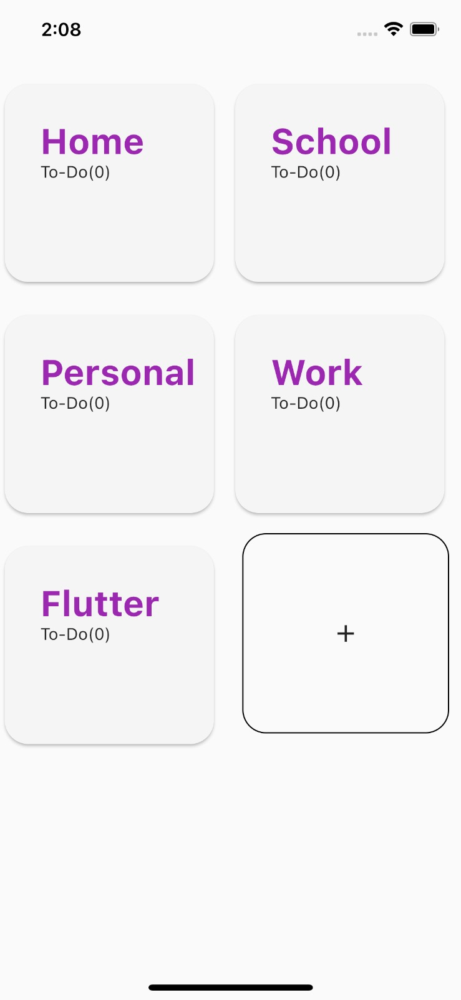
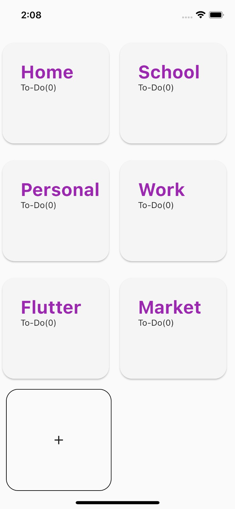
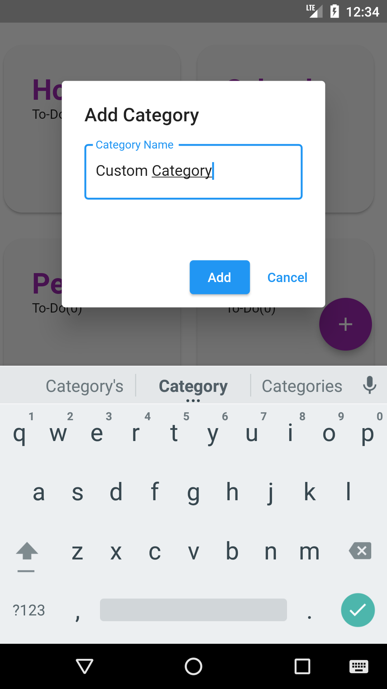
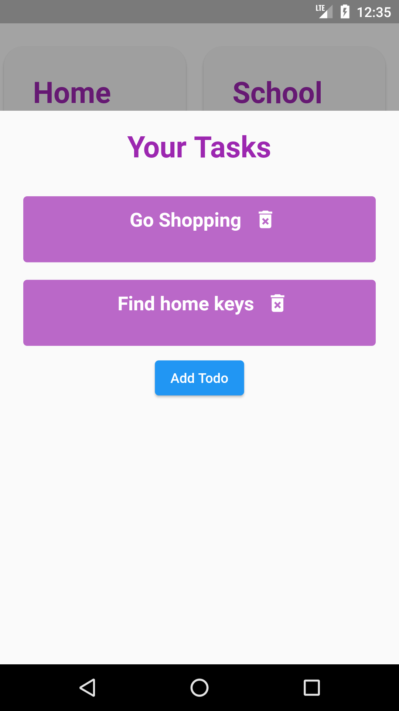

# Flutter - Grid Destune

Todo App I made with Flutter.

## Run Locally

Clone the project

```bash
  git clone https://github.com/yagizdo/Grid-Todo
```

Go to the project directory

```bash
  cd Grid-Todo
```

Install dependencies

```bash
  flutter pub get
```

Run App

```bash
  flutter run
```


## What will be add :question:

- [ ] Splash Screen
- [ ] Loading control
- [ ] Todo List size bug fix


##  Libraries I use in the application:
- Provider : https://pub.dev/packages/provider
- Shared Preferences : https://pub.dev/packages/shared_preferences
- Flutter Toast : https://pub.dev/packages/fluttertoast
- Modal Bottom Sheet : https://pub.dev/packages/modal_bottom_sheet

## Screenshots
### Homepage



### Add Category


### Todo Page



## Contributing

Contributions are always welcome!
